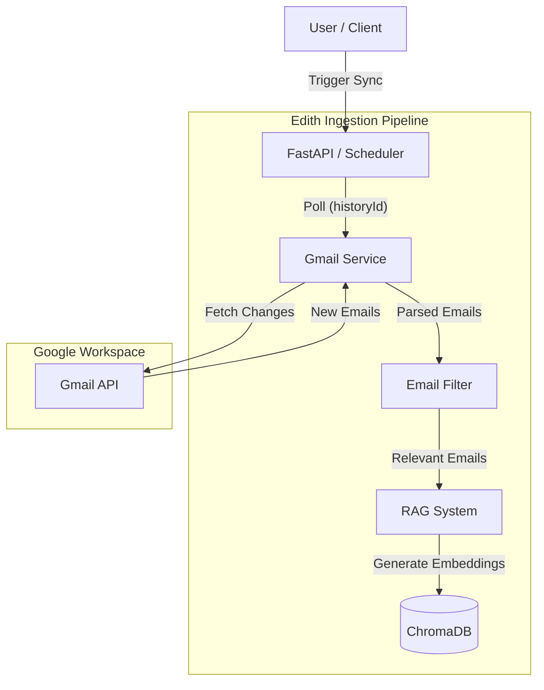
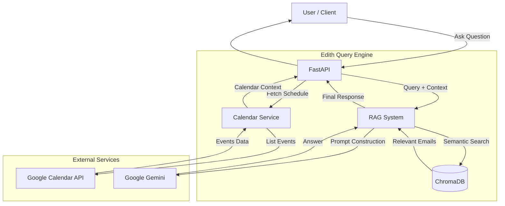

# Edith System Design

## 1. High-Level Architecture

Edith follows a **Service-Oriented Architecture** wrapped in a FastAPI backend. It acts as an intelligent bridge between the user and their raw data (Google Workspace), using a Vector Database (ChromaDB) for long-term memory and an LLM (Gemini) for reasoning.

### Ingestion Architecture

### Query Architecture

## 2. Detailed Data Flows

### A. The Ingestion Pipeline (Syncing Data)
**Strategy: Incremental Polling**
To minimize latency while avoiding complex webhook infrastructure, we use **Incremental Polling** via Gmail's `historyId`.

1.  **Fetch Delta**: A background task runs periodically (e.g., every 60s). It checks `users.history.list` using the last known `historyId` to find *only* new messages, rather than re-fetching the inbox.
2.  **Filter**: `EmailFilter` applies heuristics (regex, keyword lists, sender checks) to discard spam, marketing, and newsletters. Only "Relevant" emails pass through.
3.  **Index**: `EmailRAGSystem` takes the relevant emails, converts them into vector embeddings (using ChromaDB's default embedding function), and stores them in `ChromaDB`.

### B. The Query Pipeline (Asking Questions)
1.  **Context Gathering (Real-time)**:
    *   The system calls `CalendarService` to get upcoming events immediately (live data).
    *   The system queries `ChromaDB` for emails semantically similar to your question (historical data).
2.  **Prompt Construction**:
    *   The system builds a prompt containing System Instructions, Calendar Context, Email Context, and the User Question.
3.  **Reasoning**:
    *   This prompt is sent to **Google Gemini**, which synthesizes the information into a natural language answer.