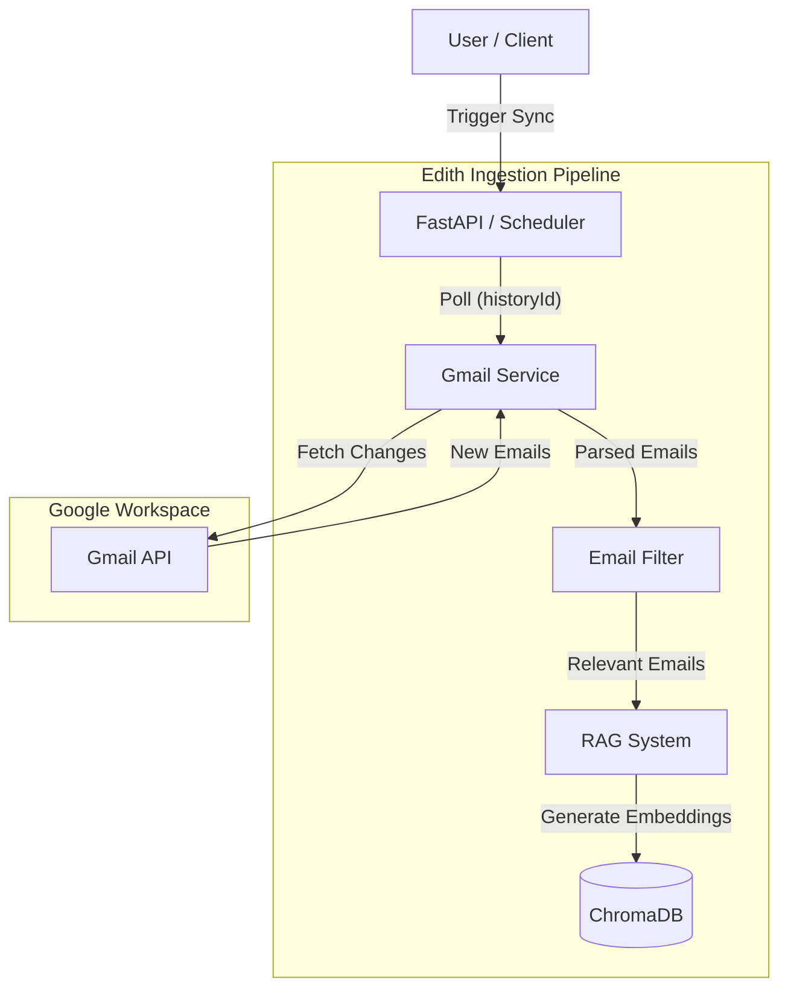
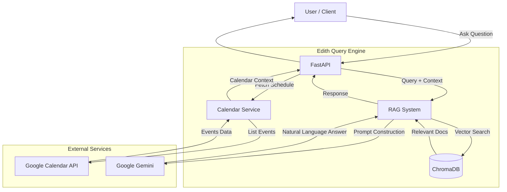

# Edith: AI Personal Assistant

Edith is a strategic personal assistant designed to aggregate your digital life—emails, calendar, meeting recordings, and notes—into a unified knowledge base.

Currently in **MVP**, Edith integrates with **Gmail** and **Google Calendar**, using RAG (Retrieval Augmented Generation) to answer natural language questions about your communications and schedule.

**Future Roadmap**: Edith aims to be a comprehensive assistant capable of:
- 🎙️ **Audio Intelligence**: Processing recorded calls and meetings.
- 🧠 **Knowledge Integration**: Syncing with Notion, Obsidian, and docs.
- 🗣️ **Voice Interaction**: Two-way voice conversations (Text-to-Speech/Speech-to-Text).

## Features

- **Email Integration**: Access and index emails from email accounts
- **Smart Email Filtering**: Automatically filter out spam and marketing emails
- **RAG System**: Use vector database to answer questions about emails
- **Calendar Integration**: Unify events from Google Calendar
- **Multi-email Support**: Configure multiple email addresses

## Quick Start

### 1. Install Dependencies

```bash
pip install -r requirements.txt
```

### 2. Set Up Environment Variables

Create a `.env` file:

```env
GEMINI_API_KEY=your_gemini_api_key_here
GMAIL_CREDENTIALS_PATH=credentials.json
CHROMA_DB_PATH=./chroma_db
GEMINI_MODEL=gemini-2.5-flash
EDITH_ENV=dev
```

### 3. Google API Setup

1. Go to [Google Cloud Console](https://console.cloud.google.com/)
2. Create a new project or select existing one
3. **Configure OAuth Consent Screen**:
   - Go to **APIs & Services** > **OAuth consent screen**.
   - Select **External** user type.
   - **Crucial**: Under **Test users**, click **Add Users** and add your specific Gmail address.
4. Enable Gmail API and Google Calendar API
5. Create OAuth 2.0 credentials (select **Desktop app**)
6. Download the credentials JSON file and save it as `credentials.json`

### 4. Run the Application

```bash
python api.py
```

The API will be available at `http://localhost:8000`

### Troubleshooting Models

If you receive 404 errors regarding models, run this script to see which models are available to your API key:
```bash
python list_models.py
```

### 5. Docker Development (Optional)

You can run the application and tests in a containerized environment.

**Prerequisite**: Ensure you have authenticated locally once to generate `token.json`, as browser authentication is harder inside Docker.

**Start the API:**
```bash
docker compose up
```

## API Endpoints

### Add Email Account
```http
POST /add-email-account
Content-Type: application/json

{
  "email_address": "your.email@gmail.com",
  "is_primary": true,
  "account_type": "personal"
}
```

### Sync Emails
```http
POST /sync-emails
```

### Ask Questions
```http
POST /ask-question
Content-Type: application/json

{
  "question": "What meetings do I have this week?"
}
```

### Get Email Summary
```http
GET /email-summary?days=7
```

### Get Calendar Events
```http
GET /calendar-events?days_ahead=30
```

### Get Relevant Emails
```http
GET /relevant-emails?limit=20
```

## Architecture


### Query Architecture


### Core Components

1. **GmailService**: Handles Gmail API authentication and email retrieval
2. **EmailFilter**: Filters out spam and identifies relevant emails
3. **EmailRAGSystem**: Uses ChromaDB and Gemini for RAG functionality
4. **CalendarService**: Integrates with Google Calendar API
5. **FastAPI Application**: Provides REST API interface

### Email Filtering Strategy

The system uses multiple criteria to identify relevant emails:

- **Important Senders**: Customizable list of important contacts
- **Subject Keywords**: Looks for meeting, deadline, urgent keywords
- **Recent Emails**: Prioritizes emails from last 30 days
- **Reply Detection**: Identifies email threads
- **Content Analysis**: Uses regex patterns to find action items
- **Spam Detection**: Filters out marketing and promotional content

### RAG Implementation

- Uses Sentence Transformers for email embeddings
- ChromaDB for vector storage and similarity search
- Google Gemini for question answering
- Context-aware responses based on retrieved emails

## MVP Limitations

- Gmail only (planned: Outlook, Apple Mail)
- Google Calendar only (planned: Outlook Calendar, Apple Calendar)
- No chat integration (planned: Slack, Teams)
- Basic filtering (planned: ML-based classification)
- No real-time updates (planned: webhook integration)

## Development Roadmap

### Phase 1: MVP (Current)
- [x] Gmail integration
- [x] Basic email filtering
- [x] RAG system
- [x] Google Calendar integration
- [x] REST API

### Phase 2: Voice & Audio Intelligence
- [ ] **Voice Interface**: Speech-to-Text (STT) and Text-to-Speech (TTS) for hands-free interaction
- [ ] **Audio Ingestion**: Pipeline for recorded calls and meetings
- [ ] **Transcription**: Auto-transcribe audio content for RAG indexing

### Phase 3: Knowledge Base Expansion
- [ ] **Notion Integration**: Index workspaces and pages
- [ ] **Document Support**: PDF, Docx, and Obsidian/Markdown notes
- [ ] **Unified Search**: Query across emails, calendar, and notes simultaneously

### Phase 4: Platform & Integrations
- [ ] **Mobile App**: Native interface for voice interaction
- [ ] **Chat Integrations**: Slack & Microsoft Teams bots
- [ ] **Real-time Processing**: Webhook support for instant updates
- [ ] **Multi-Provider Support**: Outlook, Apple Mail/Calendar

## Security Considerations

- OAuth 2.0 for Google API authentication
- Local storage of credentials (encrypted in production)
- No email content stored with third parties
- Optional on-premise deployment

## Contributing

1. Fork the repository
2. Create a feature branch
3. Make your changes
4. Add tests if applicable
5. Submit a pull request

## License

MIT License - see LICENSE file for details
