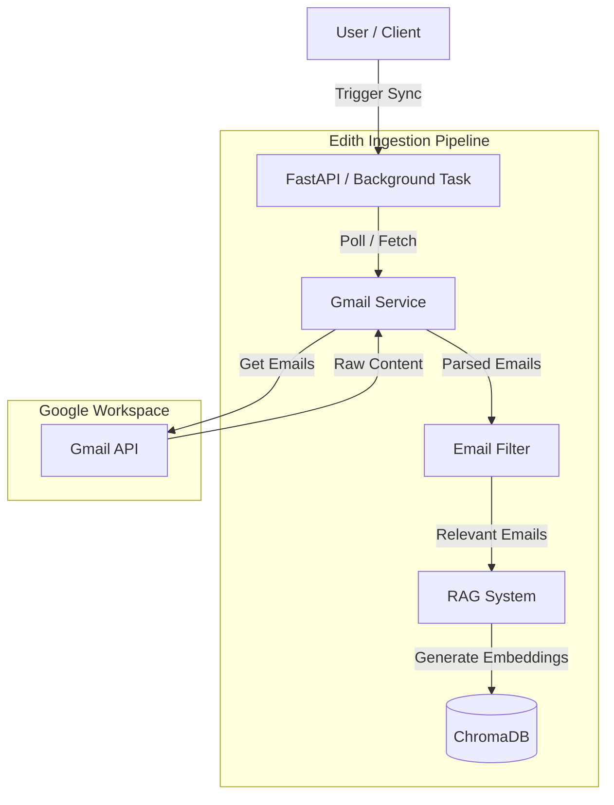
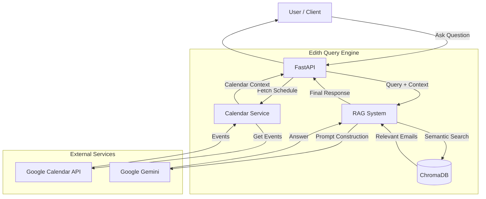

# Edith System Design

## 1. High-Level Architecture

Edith follows a **Service-Oriented Architecture** wrapped in a FastAPI backend. It acts as an intelligent bridge between the user and their raw data (Google Workspace), using a Vector Database (ChromaDB) for long-term memory and an LLM (Gemini) for reasoning.

### Ingestion Architecture

### Query Architecture

## 2. Detailed Data Flows

### A. The Ingestion Pipeline (Syncing Data)
**Strategy: Incremental Polling**
To minimize latency while avoiding complex webhook infrastructure, we use **Incremental Polling** via Gmail's `historyId`.

1.  **Fetch Delta**: A background task runs periodically (e.g., every 60s). It checks `users.history.list` using the last known `historyId` to find *only* new messages, rather than re-fetching the inbox.
2.  **Filter**: `EmailFilter` applies heuristics (regex, keyword lists, sender checks) to discard spam, marketing, and newsletters. Only "Relevant" emails pass through.
3.  **Index**: `EmailRAGSystem` takes the relevant emails, converts them into vector embeddings (using ChromaDB's default embedding function), and stores them in `ChromaDB`.

### B. The Query Pipeline (Asking Questions)
1.  **Context Gathering (Real-time)**:
    *   The system calls `CalendarService` to get upcoming events immediately (live data).
    *   The system queries `ChromaDB` for emails semantically similar to your question (historical data).
2.  **Prompt Construction**:
    *   The system builds a prompt containing System Instructions, Calendar Context, Email Context, and the User Question.
3.  **Reasoning**:
    *   This prompt is sent to **Google Gemini**, which synthesizes the information into a natural language answer.

## 3. Commercialization & Privacy Strategy

To commercialize Edith while maintaining user privacy and removing the friction of "Bring Your Own Key" (BYOK), we propose the following architectural shifts.

### A. The Proxy Model (Solving API Keys)
Instead of users providing their own `GEMINI_API_KEY`, the commercial version of Edith acts as a proxy.

1.  **Centralized Key Management**: The backend holds a master API key in secure environment variables.
2.  **Multi-tenancy**: The API is refactored to handle multiple users, tracking token usage per user ID to ensure costs align with subscription tiers.
3.  **Rate Limiting**: Implementation of strict rate limits (e.g., 50 queries/day) to prevent abuse of the master key.

### B. Monetization Models

#### 1. "Private Cloud" Subscription (SaaS)
*   **Target**: Users who want convenience and don't want to manage servers.
*   **Architecture**: Multi-tenant cloud deployment.
*   **Privacy**:
    *   **Ephemeral Processing**: Email bodies are processed in memory and only vector embeddings are stored.
    *   **Tenant Isolation**: Each user gets a dedicated ChromaDB collection.
    *   **Compliance**: SOC2 audits to verify data handling practices.

#### 2. "Self-Hosted" License (Enterprise / Pro)
*   **Target**: Privacy-absolutists and enterprises.
*   **Architecture**: User runs the Docker container on their own infrastructure (laptop or on-prem server).
*   **Privacy**: Data never leaves their network (except for the LLM call, if using cloud models).
*   **Monetization**: Annual software license fee.

### C. The Ultimate Privacy Feature: Local LLMs
To offer a truly offline, zero-trust option, Edith can support local inference.

*   **Integration**: Support for **Ollama** or **LocalAI** as drop-in replacements for the Gemini API.
*   **Benefit**: No API key required, no data sent to the cloud, works without internet.
*   **Trade-off**: Requires more powerful user hardware (GPU/RAM) and may have higher latency/lower reasoning quality compared to Gemini 2.5.